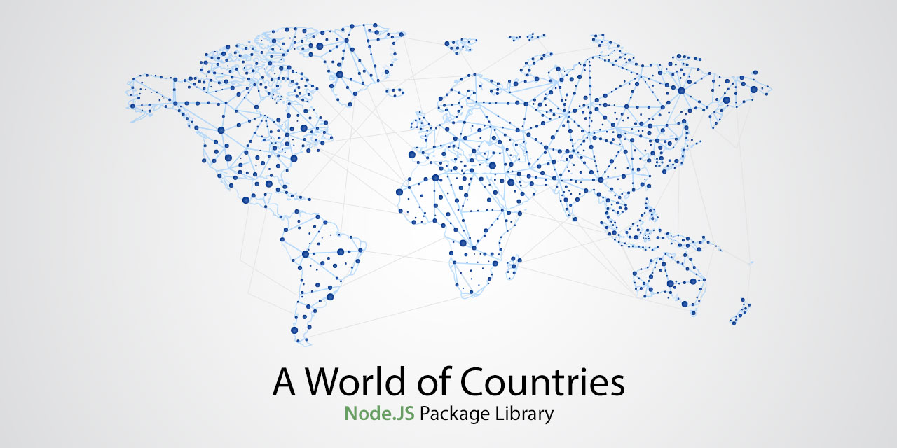

# A World of Countries


A World of Countries (AWOC) is a fully-featured library that provides an easy layer to access mutiple data about world continents and countries, according to the ISO Standard 3166-1.


[](https://circleci.com/gh/lucagrandicelli/a-world-of-countries)

## Installation

```
$ npm install a-world-of-countries
```

## How to use the AWOC library

```javascript
// Require the AWOC package.
const AWOC = require('a-world-of-countries')

// Initialize the AWOC class.
const myWorld = new AWOC()

// Let's retrieve the full list of nations of Europe.
const countriesOfEurope = myWorld.getCountriesListOf('Europe')
// It returns: [ 'Albania', 'Andorra', 'Austria', 'Belarus', 'Belgium', and so on... ]

// We can get the whole country data as well.
const italyData = myWorld.getCountryData('Italy')
/** Returns:
{
  'Country Name': 'Italy',
  ISO2: 'IT',
  ISO3: 'ITA',
  TLD: 'it',
  FIPS: 'IT',
  'ISO Numeric': '380',
  GeoNameID: '3175395',
  E164: '39',
  'Phone Code': '39',
  'Continent Name': 'Europe',
  'Continent Code': 'eu',
  Capital: 'Rome',
  'Time Zone in Capital': 'Europe/Rome',
  'Currency Name': 'Euro',
  Languages:
   'Italian (official), German (parts of Trentino-Alto Adige region are predominantly German-speaking), French (small French-speaking minority in Valle d\'Aosta region), Slovene (Slovene-speaking minority in the Trieste-Gorizia area)',
  'Area KM2': '301230'
}
*/
```

## How it works

A World of Countries is a library based upon a world.json file which holds all the continents and countries informations we need. The file is constantly evolving and this library, encoded in the form of a JS class, exposes a list of methods you can use to access those data without the hassle of writing data extraction code.

In the `data/world.json` (known as Global World Data Object, GWDO) file, every country is encoded as an object /w the following properties:

- **Country Name** - Full name of the country. E.g. "Italy".
- **ISO2** - ISO2/3166-1 alpha-2 country code. E.g. "IT"
- **ISO3** - ISO2/3166-1 alpha-2 country code. E.g. "ITA"
- **TLD** - Top Level Domain code. E.g. "it"
- **FIPS** - Federal Information Processing Standards (FIPS) code. E.g. "IT"
- **ISO Numeric** - ISO 3166-1 numeric code. E.g. "380"
- **GeoNameID** - GEO Name ID. E.g. "3175395"
- **E164** - International Public Telecommunication Numbering Plan Code. E.g. "39"
- **Phone Code**- Country phone code. E.g. "39"
- **Continent Name** - Full name of the continent the country belongs to. E.g. "Europe"
- **Continent Code** - Continent code the country belongs to. E.g. "eu"
- **Capital** - Country capital city. E.g. "Rome"
- **Time Zone in Capital** - Full definition of the country time zone. E.g. "Europe/Rome"
- **Currency Name** - Full currency name. E.g. "Euro"
- **Languages** - A verbose list of spoken languages. E.g. "Italian (official), German (parts of Trentino-Alto Adige region are predominantly German-speaking), French (small French-speaking minority in Valle d'Aosta region), Slovene (Slovene-speaking minority in the Trieste-Gorizia area)"
- **Area KM2** - Geographic extension area in km2/mi2. E.g. "301230"

## AWOC Available Methods

The whole library code is heavily commented, so every class property or method exposes a verbose explanation of its purpose. Feel free to inspect the code and find you preferred method of work. The following is the updated list of all AWOC available methods.

## WORLD CONTINENTS

_List of all AWOC.js methods about world continents._

### getContinentsList()

**Description**: returns an array of continent names as strings.

```javascript
// Let's fetch a list of all continents of planet Earth.
const continentsList = myWorld.getContinentsList()
// Returns: ['Africa', 'Antarctica', 'Asia', 'Europe', 'North America', 'Oceania', 'South America']
```

### getContinents()

**Description**: returns an array of continent objects.

```javascript
// Let's fetch a list of all continents of planet Earth in form of data objects.
const continentsData = myWorld.getContinents()
/**
 Returns:
 [
  { 'Continent Code': 'af', 'Continent Name': 'Africa' },
  { 'Continent Code': 'an', 'Continent Name': 'Antarctica' },
  { 'Continent Code': 'as', 'Continent Name': 'Asia' },
  { 'Continent Code': 'eu', 'Continent Name': 'Europe' },
  { 'Continent Code': 'na', 'Continent Name': 'North America' },
  { 'Continent Code': 'oc', 'Continent Name': 'Oceania' },
  { 'Continent Code': 'sa', 'Continent Name': 'South America' }
 ]
*/
```

## WORLD COUNTRIES

### getCountries()

**Description**: This method extracts all the countries data from the GWOD. It performs an additional sort by country name to ensure the correct alphabetical order, regardless of the GWOD json objects order (which might fail).

```javascript
// Let's fetch the data of all countries of the world.
const countries = myWorld.getCountries()
/**
 Returns the full list of country objects.
 [...
 { 'Country Name': 'Cocos Islands', ISO2: 'CC', ISO3: 'CCK', TLD: 'cc', .. },
 { 'Country Name': 'Colombia', ISO2: 'CO', ISO3: 'COL', TLD: 'co', ... },
 ... ]
*/
```

### getCountryData(countryName, field = false)

**Description**: this method returns a single country object data. If a `field` parameter is specified, then the method will return its value. For a list of available fields, please check the country data structure above.

```javascript
// We can fetch a single value from the country data object.
const capitalOfSpain = myWorld.getCountryData('Spain', 'Capital')
// Returns: "Madrid".

// ... or just the full object.
const spainData = myWorld.getCountryData('Spain')
// Returns: {'Country Name': 'Spain', ISO2: 'ES', ISO3: 'ESP', TLD: 'es', ... }
```

### getCountriesList()

**Description**: this method returns an array of country names sorted alphabetically.

```javascript
// Let's fetch a list of world nations.
const getCountriesList = myWorld.getCountriesList()
// Returns: ['Afghanistan', 'Albania', 'Algeria', 'American Samoa', 'Andorra', ...]
```

### getCountriesListOf(continentName)

**Description**: this method returns an array of country names sorted alphabetically for a specific continent.

```javascript
// Let's fetch the list of nations of Europe.
const nationsOfEurope = myWorld.getCountriesListOf('Europe')
// Returns: [ 'Albania', 'Andorra', 'Austria', 'Belarus', 'Belgium', ...]
```

### getCountriesDataOf(continentName)

**Description**: this method returns an array of country objects alphabetically sorted per each country name for a specific continent.

```javascript
// Let's fetch the list of nations of Europe in form of country objects.
const nationsOfEurope = myWorld.getCountriesDataOf('Europe')
/**
 Returns:
 [
  { 'Country Name': 'Albania', ISO2: 'AL', ISO3: 'ALB', ... },
  { 'Country Name': 'Andorra', ISO2: 'AD', ISO3: 'AND', ... }
 ]
*/
```

### getCountryISO2(countryName)

**Description**: this method returns the ISO2 code for the specified country.

```javascript
const italyISO2 = myWorld.getCountryISO2('Italy')
// Returns: 'IT'
```

### getCountryISO3(countryName)

**Description**: this method returns the ISO3 code for the specified country.

```javascript
const italyISO3 = myWorld.getCountryISO3('Italy')
// Returns: 'ITA'
```

### getCountryTLD(countryName)

**Description**: this method returns the Top Level Domain (TLD) for the specified country.

```javascript
const italyTLD = myWorld.getCountryTLD('Italy')
// Returns: 'it'
```

### getCountryFIPS(countryName)

**Description**: this method returns the FIPS country code for the specified country.

```javascript
const italyFIPS = myWorld.getCountryFIPS('Italy')
// Returns: 'IT'
```

### getCountryISONumeric(countryName)

**Description**: this method returns the ISO Numeric code for the specified country.

```javascript
const italyISONumeric = myWorld.getCountryISONumeric('Italy')
// Returns: '380'
```

### getCountryGeoNameID(countryName)

**Description**: this method returns the GEO Name ID for the specified country.

```javascript
const italyGEONameID = myWorld.getCountryGeoNameID('Italy')
// Returns: '3175395'
```

### getCountryE164(countryName)

**Description**: this method returns the E164 code for the specified country.

```javascript
const italyE164 = myWorld.getCountryE164('Italy')
// Returns: '39'
```

### getCountryPhoneCode(countryName)

**Description**: this method returns the Phone Code for the specified country.

```javascript
const italyPhoneCode = myWorld.getCountryPhoneCode('Italy')
// Returns: '39'
```

### getCountryContinentName(countryName)

**Description**: this method returns the continent data the specified country belongs to.

```javascript
const italyContinentName = myWorld.getCountryContinentName('Italy')
// Returns: 'Europe'
```

### getCountryContinentCode(countryName)

**Description**: this method returns the continent code the specified country belongs to.

```javascript
const italyContinentCode = myWorld.getCountryContinentCode('Italy')
// Returns: 'eu'
```

### getCountryCapitalCity(countryName)

**Description**: this method returns the capital city of the specified country.

```javascript
const capitalOfItaly = myWorld.getCountryCapitalCity('Italy')
// Returns: 'Rome'
```

### getCountryTimeZone(countryName)

**Description**: this method returns a time zone value for the specific country.

```javascript
const italyTimeZone = myWorld.getCountryTimeZone('Italy')
// Returns: 'Europe/Rome'
```

### getCountryCurrencyName(countryName)

**Description**: this method returns the currency name for the specified country.

```javascript
const italyCurrencyName = myWorld.getCountryCurrencyName('Italy')
// Returns: 'Euro'
```

### getCountriesListByCurrency(currencyName, continentName = false)

**Description**: this method returns an array of country names filtered by a specific currency.

```javascript
// Let's fetch all the countries where the dollar is used.
const dollarNations = myWorld.getCountriesListByCurrency('Dollar')
// Returns: [ 'American Samoa', 'Anguilla', 'Antigua and Barbuda', 'Australia', 'Bahamas', ... ]

// We can also filter the above by continent.
const dollarNationsInSouthAmerica = myWorld.getCountriesListByCurrency(
  'Dollar',
  'South America'
)
// Returns: [ 'Ecuador', 'Guyana', 'Suriname' ]
```

### getCountriesDataByCurrency(currencyName, continentName = false)

**Description**: this method returns one or multiple country object data for a specific currency.

```javascript
// Let's fetch all the countries where the dollar is used in form of data objects
const dollarNationsObj = myWorld.getCountriesDataByCurrency('Dollar')
/**
 Returns:
 [...
  { 'Country Name': 'American Samoa', ISO2: 'AS', ISO3: 'ASM', TLD: 'as', FIPS: 'AQ', ... },
  { 'Country Name': 'Anguilla', ISO2: 'AI', ISO3: 'AIA', TLD: 'ai', FIPS: 'AV', ... },
 ...]
*/

// We can also filter the above by continent.
const dollarNationsInSouthAmericaObj = myWorld.getCountriesDataByCurrency(
  'Dollar',
  'South America'
)
/**
 Returns:
 [
   { 'Country Name': 'Ecuador', ISO2: 'EC', ISO3: 'ECU', TLD: 'ec', FIPS: 'EC', ... },
   { 'Country Name': 'Guyana',  ISO2: 'GY', ISO3: 'GUY', TLD: 'gy', FIPS: 'GY', ... },
   { 'Country Name': 'Suriname', ISO2: 'SR', ISO3: 'SUR', TLD: 'sr', FIPS: 'NS', ... }
 ]
 */
```

### getCountryLanguages(countryName)

**Description**: this method returns a list of languages for the specific country.

```javascript
const italyLanguageCodes = myWorld.getCountryLanguages('Italy')
// Returns: 'Italian (official)', 'German (parts of Trentino-Alto Adige region are predominantly German-speaking)', 'French (small French-speaking minority in Valle d\'Aosta region)', 'Slovene (Slovene-speaking minority in the Trieste-Gorizia area)'.
```

### getCountryArea(countryName, unit = 'km2')

**Description**: this method returns the country area in km2 or mi2.

```javascript
// Let's fetch the extension area of Italy in km2
const italyExtensionAreaKm2 = myWorld.getCountryArea('Italy')
// Returns: 301230

// We can fetch it in mi2 too.
const italyExtensionAreaMi2 = myWorld.getCountryArea('Italy', 'mi2')
// Returns: 116305.44
```

## Changelog

### 1.0.0

Initial release.

## Licence

[MIT](https://github.com/lucagrandicelli/a-world-of-countries/blob/master/LICENSE)

## Credits

- Cover image by [freepik](https://it.freepik.com/foto-vettori-gratuito/viaggio).
